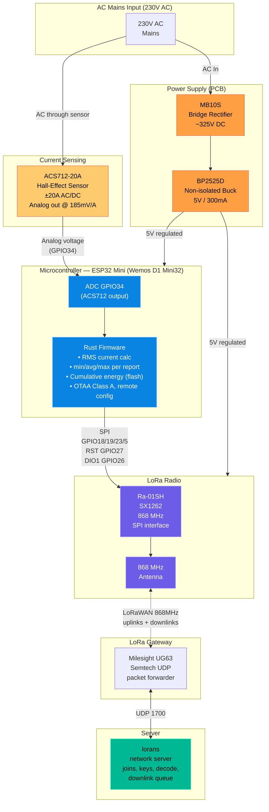

# System overview

## Data flow

| Stage | Component | Protocol |
|-------|-----------|----------|
| AC sense | ACS712-20A → GPIO34 | Analog voltage |
| Compute | ESP32 (Rust firmware) | Internal |
| Transmit | SX1262 Ra-01SH | LoRaWAN 868 MHz, FPort 85 |
| Forward | Milesight UG63 gateway | Semtech UDP |
| Decode and configure | `software/lorans` | See [`docs/PROTOCOL.md`](../docs/PROTOCOL.md) |

## Power budget (5V rail)

| Component | Current |
|-----------|---------|
| ESP32 (no WiFi/BLE) | ~80 mA |
| SX1262 TX peak | ~120 mA |
| ACS712 | ~10 mA |
| **Total peak** | **~200 mA** |
| BP2525D capacity | 300 mA cont / 500 mA pulse |
